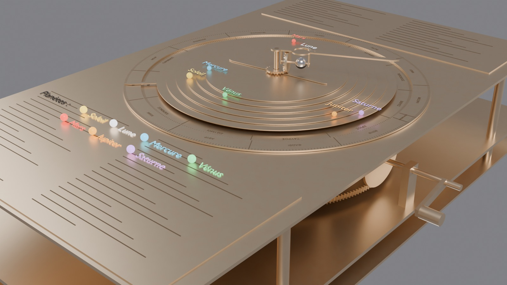
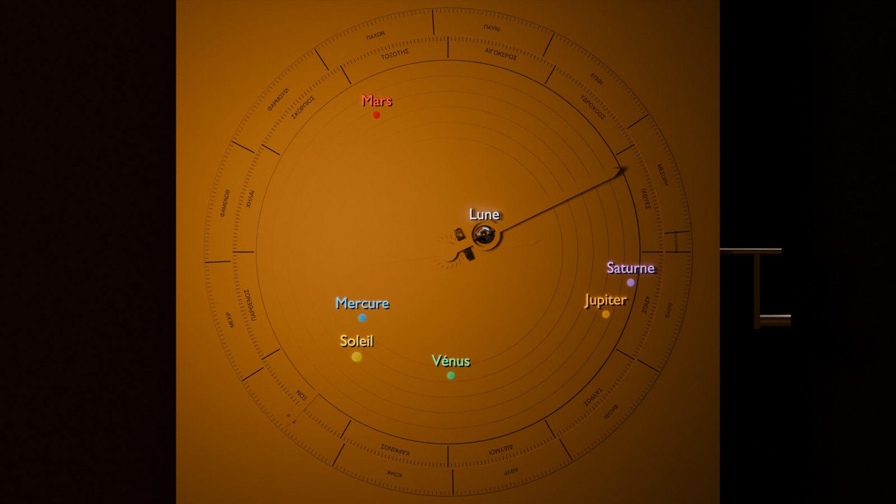
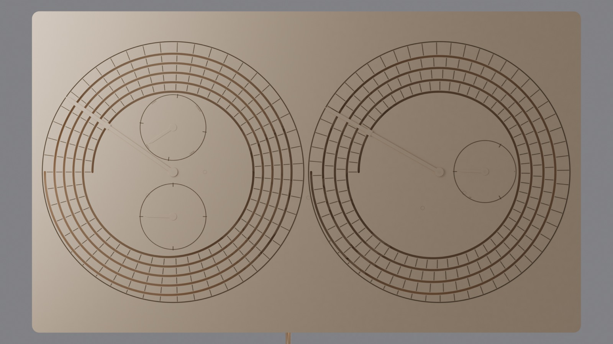
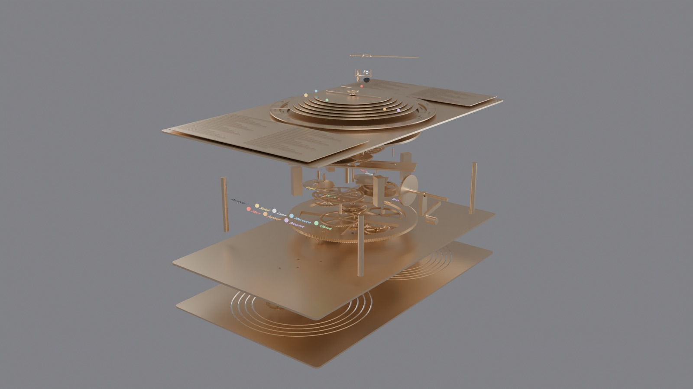
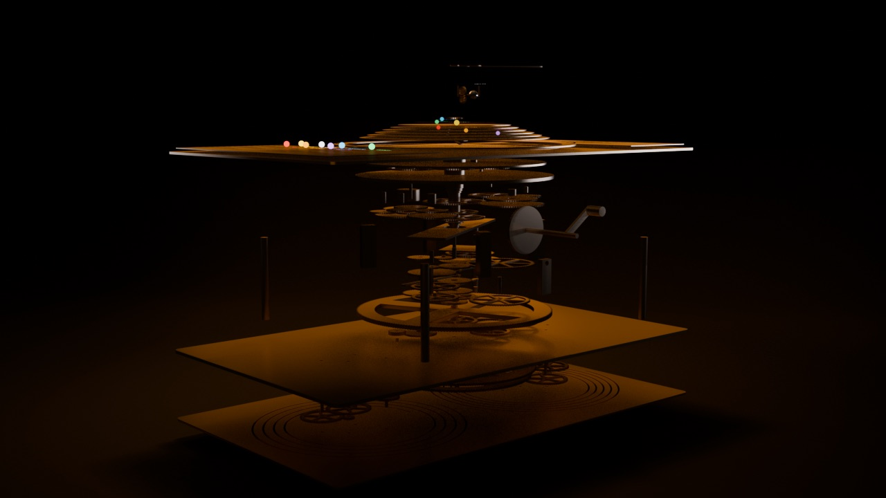

# Mecanismo de Anticitera: una reconstrucción 3D funcional y verificada

[English](README.md) · [Français](README.fr.md) · **Español** · [Deutsch](README.de.md) · [Italiano](README.it.md) · [Português](README.pt.md) · [Ελληνικά](README.el.md) · [中文](README.zh.md) · [日本語](README.ja.md)

[](https://github.com/taciclei/antikythera-mechanism/actions/workflows/lean.yml)



https://github.com/user-attachments/assets/c810d3ee-ecfa-46e3-b11d-f919c3ae2cd9

https://github.com/user-attachments/assets/40b1f61b-5fb0-4b54-bd1c-1ba1f423a424


El mecanismo de Anticitera es una calculadora astronómica de bronce accionada por manivela, construida en Grecia en el siglo II o I a. C. y recuperada de un naufragio en 1901. Es la máquina de engranajes compleja más antigua que se conoce. Este repositorio contiene una reconstrucción 3D completa del mecanismo en **Blender 5.2**:

- los **69 engranajes** tienen su número real de dientes;
- los dientes son de evolvente conjugados, de modo que cada par engrana y funciona de verdad;
- cada tren de engranajes se ha **comprobado con fracciones exactas** frente al ciclo astronómico que modela;
- las piezas se han **sometido a comprobación de colisiones** en todo el rango de movimiento.

Toda la construcción la realizó Claude Opus 5.5 en una sola pasada a partir de un único prompt maestro autocontenido ([`PROMPT_OPUS.md`](PROMPT_OPUS.md)), y después se verificó de forma independiente.

## Aspectos destacados

- **69 engranajes**, etiquetados según su grado de certeza:
  - 30 **conservados**, físicamente presentes en los fragmentos (tomografías computarizadas);
  - 7 **reconstruidos**, a partir de pruebas sólidas;
  - 32 **hipotéticos**, según el modelo de Freeth et al. 2021.

  Cada estado tiene su propia colección de Blender, de modo que cada grupo puede ocultarse o mostrarse.
- **Matemáticas exactas.** 1 vuelta de la rueda principal b1 equivale a 1 año. El mecanismo tiene exactamente **un grado de libertad** (la manivela), y los 22 objetivos coinciden exactamente como fracciones (véase una muestra a continuación).

  | Salida | Velocidad exacta (vueltas/año) | Ciclo |
  |---|---|---|
  | Luna (media) | 254/19 | 254 meses siderales en 19 años |
  | Esfera metónica | −5/19 | 5 vueltas = 19 años = 235 meses lunares |
  | Esfera del saros | −940/4237 | 4 vueltas = 223 meses lunares |
  | Nodos lunares (aguja del Dragón) | −5/93 | 18.6 años, en sentido inverso |
  | Venus | 289/462 respecto a b1 | 289 periodos sinódicos en 462 años |
- **Demostrado formalmente en Lean 4.** [`lean/`](lean/README.md) contiene 193 teoremas, comprobados por el núcleo de Lean con Mathlib, sin ningún `sorry`:
  - la cinemática de velocidades medias tiene exactamente **un grado de libertad**, y todas las velocidades se deducen del número de dientes;
  - se cumplen los 22 objetivos, y también los ciclos metónico, del saros, del exeligmos, calípico y de las Olimpiadas, así como las relaciones entre los periodos planetarios;
  - las 37 distancias entre centros son correctas con una precisión de 10⁻⁶ mm;
  - los mecanismos de pasador y ranura conservan sus velocidades medias, y la amplitud de la anomalía lunar está entre 6.579° y 6.581°.

  Las pruebas de mutación muestran que Lean rechaza un número de dientes erróneo, un objetivo erróneo o un eje mal colocado.
- **Funciona mecánicamente.**
  - Las distancias entre centros son exactas hasta 10⁻⁶ mm, y todas las relaciones de contacto son ≥ 1.2.
  - Hay **0 interpenetraciones** en miles de muestras 3D (BVH): cada engrane a lo largo de un paso de diente, cada ciclo de pasador y ranura, y 168 pares de piezas en 240 posiciones de la manivela.
- **La Luna acelera y frena con engranajes redondos**, no ovalados. Un mecanismo de pasador y ranura sobre la plataforma giratoria e3 reproduce la anomalía lunar de Hiparco (±6.58°).
- **Los planetas retroceden en el momento justo.** Marte, Júpiter y Saturno entran en movimiento retrógrado en la oposición (180° ± 0.03°), y Mercurio y Venus permanecen dentro de sus elongaciones máximas.
- **Una sola manivela lo mueve todo.** Todo el movimiento procede de `AM_Controller["crank"]`, expresado en años, a través de controladores (*drivers*) de expresión simple, de modo que el archivo se anima sin necesidad de activar los scripts de Python.
- **Visualización legible.** Cada uno de los siete «planetas» antiguos tiene su propio color y una etiqueta que lo acompaña (Sol, Luna, Mercurio, Venus, Marte, Júpiter, Saturno), además de una leyenda.
- **Iluminación de museo.** La escena tiene un fondo de ciclorama oscuro y softboxes de luz cálida, y se renderiza con la gestión de color AgX. Esta configuración se eligió entre tres propuestas renderizadas y comparadas lado a lado.
- **Vista explosionada.** Mueve `AM_Controller["explode"]` de 0 a 1 y cada pieza se desplaza a lo largo del eje de apilamiento.
- **Impresión 3D.** Un STL por pieza más un 3MF completo, en tres perfiles: resina ×1, resina ×1.5 y FDM ×2.

| Esfera frontal | Esferas posteriores |
|---|---|
|  |  |

| Vista explosionada | Interior, abierto |
|---|---|
|  |  |

## Vídeos

- [`antikythera.mp4`](build/out/renders/antikythera.mp4): 20 s. La manivela avanza 4 años, y los planetas, la Luna y las esferas posteriores se mueven.
- [`antikythera_eclate.mp4`](build/out/renders/antikythera_eclate.mp4): vista explosionada de 15 s. El mecanismo se abre capa a capa mientras los engranajes siguen girando, y después vuelve a cerrarse.

Que los planetas se muevan a veces **hacia atrás** en los vídeos no es un error. Es el **movimiento retrógrado** que se observa desde la Tierra, y el mecanismo se construyó para mostrarlo. La aguja del Dragón (los nodos lunares) gira siempre en sentido inverso.

## Inicio rápido

1. Instala **Blender 5.2** o una versión posterior.
2. Abre [`build/out/am.blend`](build/out/am.blend) y pulsa **Espacio** para reproducir la animación.
3. Selecciona `AM_Controller` y cambia sus propiedades personalizadas:
   - `crank`: años; 1 es una vuelta de b1;
   - `explode`: de 0 a 1;
   - `patina`: 0 es bronce nuevo, 1 es pátina de museo.
4. Usa el Outliner para ocultar colecciones:
   - `AM_CASE` y `AM_DIALS` para ver el engranaje;
   - `AM_HYPOTHETICAL` para conservar solo lo que está atestiguado;
   - `AM_LABELS` para quitar las etiquetas;
   - `AM_STAGE` para quitar el decorado de iluminación.
5. Haz clic en cualquier pieza para leer sus propiedades personalizadas: `status`, `role`, `teeth`, `module` y `sources`.

### Volver a ejecutar la verificación

Usa el Python incluido con Blender. Las rutas siguientes son para macOS; adáptalas en otros sistemas.

```sh
PY=/Applications/Blender.app/Contents/Resources/5.2/python/bin/python3.13
BL=/Applications/Blender.app/Contents/MacOS/Blender

$PY tools/validate_spec.py          # exact linear solve (1 DOF, 22 targets), centre distances, collision screening
$PY tools/check_kinematics.py       # pin-and-slot laws, followers, elongations, retrogrades, solar apogee
cd build && $PY -m unittest discover -s tests && $PY -m am.verify --stage all && cd ..
$BL -b build/out/am.blend --python-exit-code 1 -P tools/crosscheck_blend.py   # Blender rotations vs an independent solver
```

[`build/README.md`](build/README.md) enumera cada paso de construcción, comprobación, exportación y renderizado, con un comando por paso.

### Comprobar las demostraciones formales (Lean 4)

Instala [elan](https://lean-lang.org/install) una sola vez y, después:

```sh
cd lean
lake exe cache get    # download the compiled Mathlib (about 5 GB)
lake build            # check every proof; warnings are errors, so success means no sorry
cd ..
python3 tools/lean_mutation_test.py   # Lean must reject 9 deliberately wrong mechanisms
```

[`lean/README.md`](lean/README.md) enumera lo que está demostrado, módulo por módulo, y lo que no.

### Reconstruir todo a partir del prompt maestro

En una carpeta **vacía**, con [Claude Code](https://claude.com/claude-code):

```sh
claude -p --model 'claude-opus-5-5[1m]' --effort xhigh --permission-mode acceptEdits \
  --allowedTools Bash Read Write Edit Glob Grep < PROMPT_OPUS.md
```

- [`prompts/PROMPT_OPUS_v1_validated.md`](prompts/PROMPT_OPUS_v1_validated.md) es la versión exacta que produjo esta construcción en una sola pasada (89 min).
- [`PROMPT_OPUS.md`](PROMPT_OPUS.md) es la v1.2. Añade los colores y las etiquetas de los planetas, la escenografía de museo, el control deslizante de explosión y el vídeo de la vista explosionada. Todo ello se añadió después a esta construcción con los scripts de `tools/`, y la v1.2 aún no se ha vuelto a ejecutar desde cero.

## Cómo se hizo

1. **Investigación.** Varios agentes en paralelo leyeron las fuentes primarias: Freeth et al. 2006, 2008 y 2021 (con su información suplementaria), Price 1974, Budiselic et al. 2020, Woan & Bayley 2024, Anastasiou et al. 2014, entre otras. Los resultados se conciliaron en un único conjunto de datos, que después revisó un agente escéptico.
2. **Especificación.** [`spec/antikythera.json`](spec/antikythera.json) es la única fuente de verdad. Recoge el número de dientes, el módulo, la posición del eje, el rango en z y el diámetro del orificio de cada engranaje, así como cada árbol, perno, cubo, pasador, esfera y material. Lo genera `tools/make_spec.py`, que corrige 22 imposibilidades geométricas de los datos publicados (por ejemplo, b2 no puede engranar a la vez con c1 y con l1 a las distancias publicadas). Cada distancia entre centros se resuelve de forma exacta.
3. **Comprobaciones independientes.** `tools/validate_spec.py` y `tools/check_kinematics.py` no comparten código con el generador, y las pruebas de mutación confirman que detectan los errores inyectados.
4. **Dientes de corona por envolvente.** `tools/crown_envelope.py` calcula los dientes de las ruedas de corona a1 y q1 como la región que nunca barren los dientes con los que engranan. Después, `tools/test_crowns_blender.py` los comprueba con BVH en Blender.
5. **Revisiones adversariales.** Dos rondas de revisores independientes examinaron los datos, la API de Blender (probada en vivo), la ejecutabilidad y la geometría, y encontraron 5 problemas bloqueantes y unos 60 problemas más. Todos están corregidos.
6. **Construcción en una sola pasada** por una sesión nueva de Opus 5.5 a partir únicamente del prompt: 131 turnos, unas 5,000 líneas de código y todos los criterios de aceptación en verde.
7. **Verificación independiente** del resultado: pruebas, comprobaciones exactas, la comprobación BVH completa y un contraste de cada cuerpo de `am.blend` con el solucionador independiente (7·10⁻⁷ rad).
8. **Demostraciones formales.** `tools/make_lean.py` traduce la especificación a Lean 4. La cinemática, los objetivos y las distancias entre centros se demuestran a partir de ella. Unos módulos escritos a mano añaden el análisis de pasador y ranura y la astronomía, y revisores adversariales y pruebas de mutación comprobaron que cada enunciado dice lo que afirma.

## Estructura del repositorio

```
PROMPT_OPUS.md            master prompt (v1.2), self-contained; embeds the full JSON spec + SHA-256
prompts/                  the prompt version validated by the one-pass build (v1)
spec/antikythera.json     single source of truth (gears, axes, shafts, trains, dials, staging, video)
research/                 raw multi-agent research results with source URLs
tools/                    spec generator, validators, crown envelopes, Lean generator, annotation/staging/explode/render scripts
lean/                     Lean 4 + Mathlib proofs: kinematics, targets, centre distances, pin-and-slot, astronomy
build/                    the project generated by the one-pass build (am/, blender_scripts/, tests/, README)
build/out/                am.blend, verification report (report.md/html), checks, print files, renders, videos
docs/                     dossier (HTML) and images
```

## Limitaciones reconocidas

- Los trenes planetarios, los nodos lunares y el Sol verdadero siguen el modelo **hipotético** de Freeth et al. 2021. Que la animación funcione no demuestra cómo se construyó el original.
- Algunas magnitudes no están publicadas. Para ellas, la especificación usa valores por defecto documentados, enumerados en `spec/antikythera.json` → `unresolved_defaults`:
  - los ángulos de los ejes en la placa trasera;
  - los radios de los anillos del cosmos;
  - las fases iniciales (la época no está calibrada).
- Las demostraciones en Lean cubren la cinemática de velocidades medias, los objetivos, las distancias entre centros y las leyes de pasador y ranura y de los seguidores. La relación de contacto, el solapamiento de las caras, la socavación y las colisiones se comprueban con las herramientas de Python y en Blender, no en Lean.
- Los dientes son de evolvente conjugados (cremallera de 30°, que corresponde al antiguo diente en triángulo equilátero), no los triángulos limados a mano del original.
- Los colores de los planetas solo buscan facilitar la lectura; no son históricos.

## Fuentes principales

- T. Freeth et al., "A Model of the Cosmos in the ancient Greek Antikythera Mechanism", *Scientific Reports* 11, 5821 (2021), con su información suplementaria.
- T. Freeth et al., "Decoding the ancient Greek astronomical calculator known as the Antikythera Mechanism", *Nature* 444, 587 (2006).
- T. Freeth, A. Jones, J. Steele, Y. Bitsakis, "Calendars with Olympiad display and eclipse prediction on the Antikythera Mechanism", *Nature* 454, 614 (2008).
- T. Freeth & A. Jones, "The Cosmos in the Antikythera Mechanism", ISAW Papers 4 (2012).
- D. de Solla Price, *Gears from the Greeks* (1974).
- C. Budiselic et al. (2020); G. Woan & J. Bayley (2024): número de agujeros del anillo del calendario.
- M. Anastasiou et al. (2014): las espirales de las esferas posteriores.

La lista completa con las URL está en `spec/antikythera.json` → `sources`.

## Licencia

- **Código**: MIT ([`LICENSE`](LICENSE)).
- **Renders, vídeos, modelo 3D, archivos de impresión y textos**: CC BY 4.0 ([`LICENSE-MEDIA.md`](LICENSE-MEDIA.md)).
- **Datos académicos**: por favor, cita las obras mencionadas arriba.

---

Hecho con [Claude Code](https://claude.com/claude-code) (Claude Opus 5 / 5.5) para taciclei.
